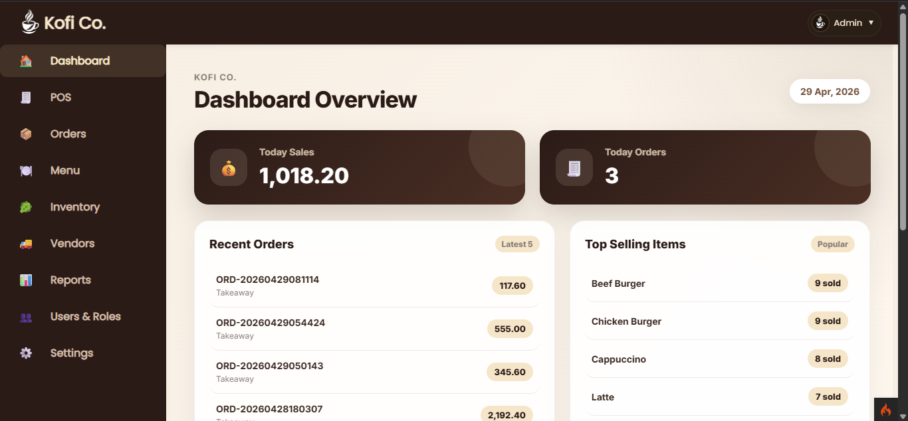
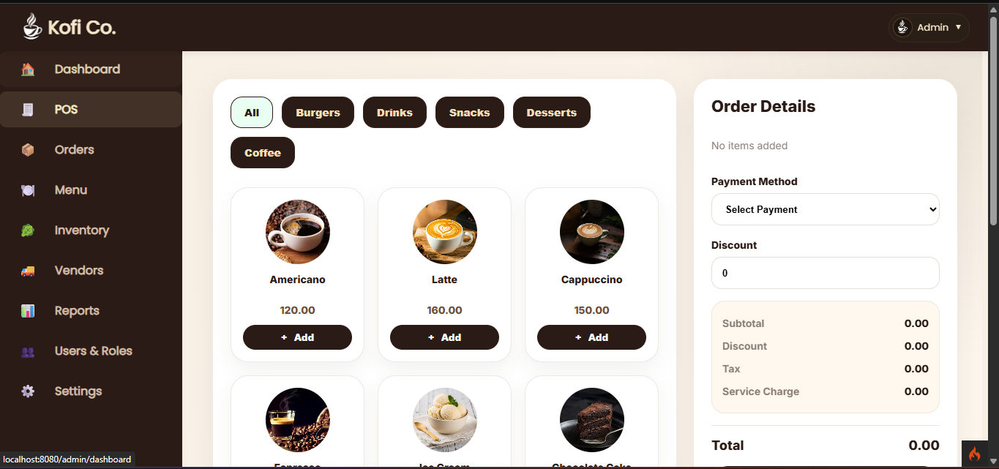
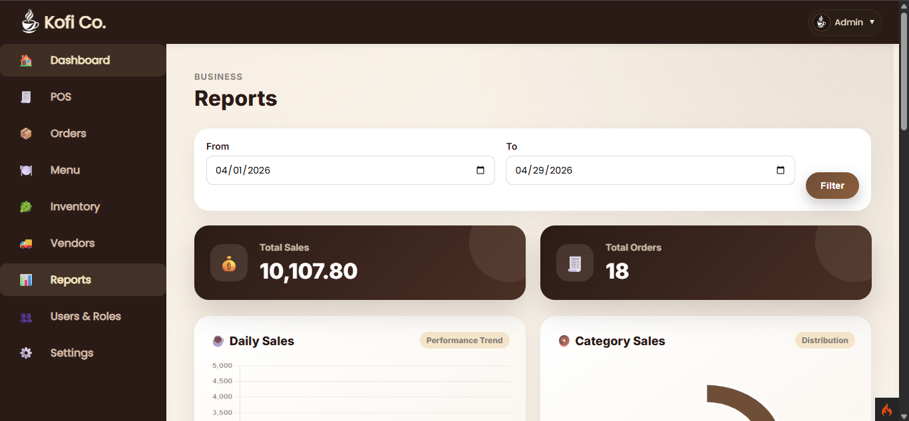
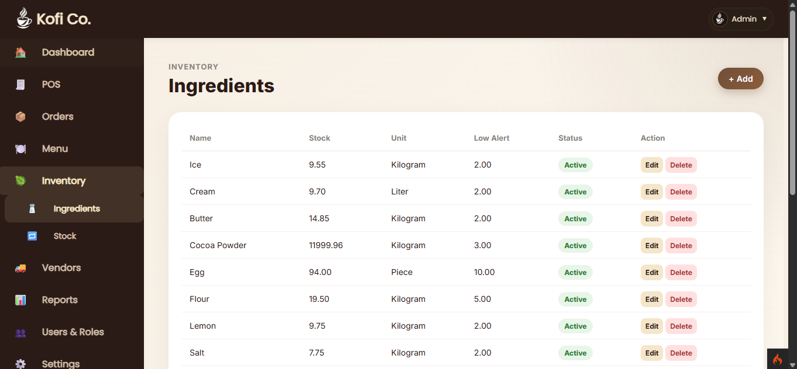
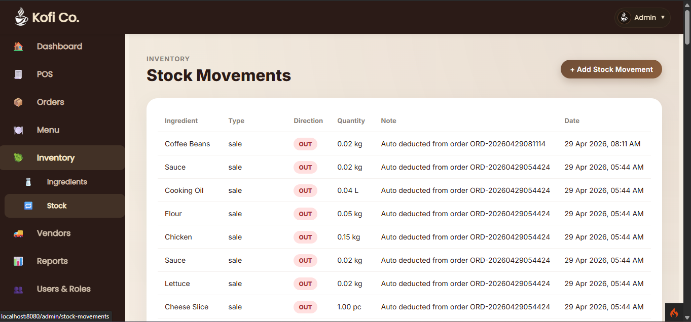
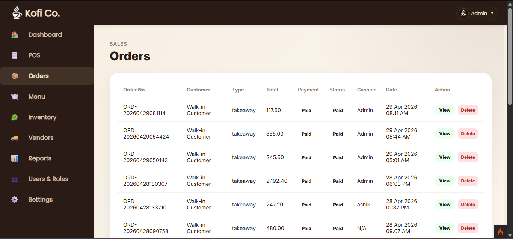
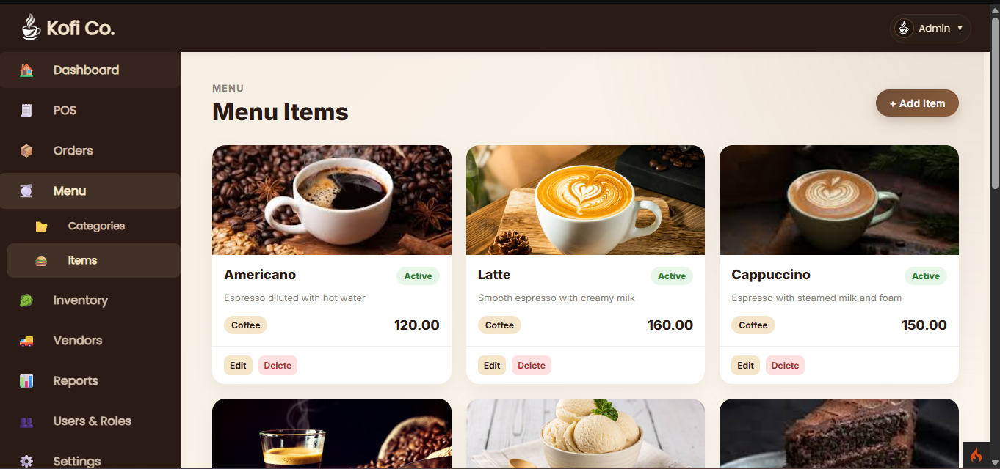
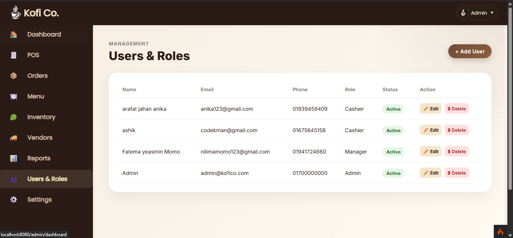
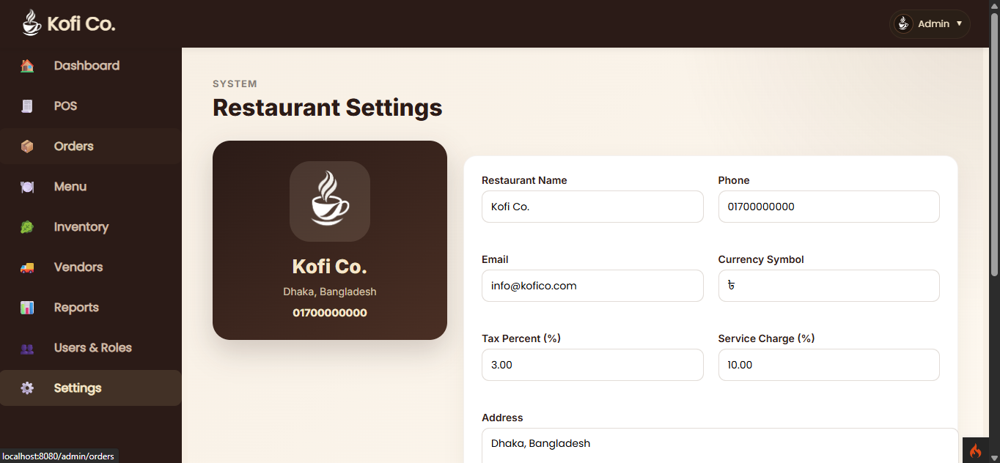

# ☕ Kofi Co - Restaurant POS & Inventory Management System

Kofi Co is a complete Restaurant Management System built with **CodeIgniter 4**.  
It includes POS, inventory tracking, recipe-based stock deduction, and reporting features.

---

## 🚀 Features

### 🧾 POS System
- Add to cart
- Checkout & payment
- Discount, tax & service charge support

### 📦 Inventory Management
- Ingredient stock tracking
- Low stock alerts
- Stock movement history

### 🍽️ Recipe System
- Menu item → ingredient mapping
- Auto stock deduction on order

### 📊 Reports & Analytics
- Daily sales report
- Category-wise sales
- Top selling items
- Payment summary (Chart.js ready)

### 👥 User Roles
- **Admin** → full access  
- **Manager** → limited control  
- **Cashier** → POS + orders  

### ⚙️ Settings
- Tax & service charge config
- Currency setup
- Logo upload
- Receipt footer

---

## 🛠️ Tech Stack

- **Backend:** CodeIgniter 4 (PHP)
- **Frontend:** HTML, CSS, JavaScript
- **Database:** MySQL
- **Charts:** Chart.js

---


## 📂 Project Structure
Kofi_Co/
├── app/
├── public/
├── database/
│ └── kofi_co.sql
├── tests/
├── .gitignore
├── composer.json
├── spark


---

## ⚙️ Installation

### 1. Clone the repository
```bash
git clone https://github.com/fatema-alt/kofi-co.git
cd kofi-co

2. Install dependencies
composer install

3. Setup environment
Copy .env.example → .env
Configure database:
database.default.hostname = localhost
database.default.database = kofi_co
database.default.username = root
database.default.password =

4. Import database
Import database/kofi_co.sql using phpMyAdmin

5. Run the project
php spark serve

6. Open:
http://localhost:8080

---


## 📸 Screenshots

### Dashboard


### POS System


### Reports


### Inventory



### Menu



### Users & Roles


### Settings


---

## 🧠 System Workflow

1. User selects items from POS
2. Order is created
3. Recipe is loaded
4. Ingredients stock is deducted
5. Stock movement is recorded
6. Payment is processed
7. Reports are updated

---

## ⚠️ Important Notes

- `.env` file is not included for security reasons
- Run `composer install` after cloning
- Make sure database is imported before running

---

## 🚀 Future Improvements

- JWT Authentication
- React Frontend (SPA)
- Real-time dashboard
- Multi-branch system
- Online ordering system

---

## 👩‍💻 Author

**Fatema Yesmin**

- GitHub: https://github.com/fatema-alt
- Project: Kofi Co POS System

---

## ⭐ Support

If you like this project, give it a ⭐ on GitHub!


